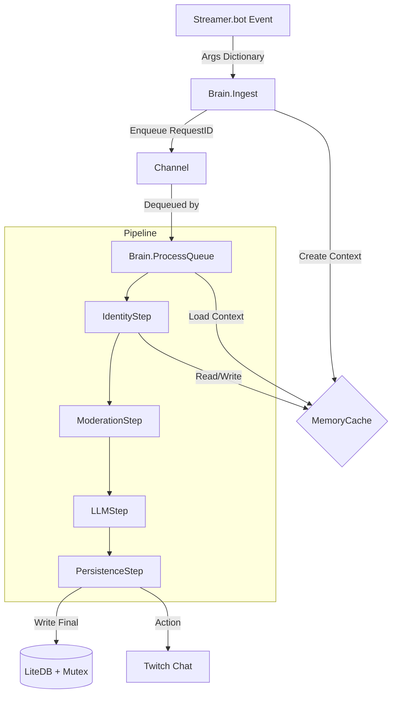

# PNGTuber-GPTv2: System Context (AI)

**System Role**: This file defines the **Technical Context** for AI Agents working on this codebase. It describes the enforced patterns, data flow, and constraints.

---

## 1. System Constraints (The "Physics")

1.  **Framework**: `.NET 4.8.1` (Strict). No .NET Core/5+ APIs.
2.  **Threading**: 
    *   **Ingestion**: MUST be Non-Blocking (`Channel.Writer.TryWrite`).
    *   **Processing**: MUST be Serial per Request (Pipeline).
    *   **Persistence**: MUST acquire `DatabaseMutex` before `new LiteDatabase()`.
3.  **State**: 
    *   **Mutable**: `RequestContext` (DTO). Held in `ICacheService`.
    *   **Immutable**: `Pronouns`, `ChatMessage` (Structs).
    *   **Persistent**: `User`, `AppSettings` (Entities).
4.  **Logging**: STRICT adherence to `logging_rules.md`. No Trace.

---

## 2. Data Flow Graph

---

## 3. Core Components Reference

### 3.1 `Brain` (Orchestrator)
*   **Location**: `Crypto/Brain.cs`
*   **Responsibility**: Converts Args -> Context, Manages Queue, Executes Steps.
*   **Key Method**: `StartProcessing(CancellationToken)`

### 3.2 `RequestContext` (State)
*   **Location**: `Domain/DTOs/RequestContext.cs`
*   **Responsibility**: The "Shopping Cart" that collects data as it moves through the steps.
*   **Lifecycle**: Created at Ingest -> enriched -> deleted after Persistence.

### 3.3 `ICacheService` (Memory)
*   **Location**: `Infrastructure/Caching/MemoryCacheService.cs`
*   **Responsibility**: Thread-safe storage of Context and Config.
*   **TTL**: Contexts expire in 10m. Configs/Users expire in 30m.

### 3.4 `DatabaseMutex` (Lock)
*   **Location**: `Infrastructure/Persistence/DatabaseMutex.cs`
*   **Responsibility**: Named `Global\PNGTuber-GPTv2-DB-Lock`.
*   **Pattern**: `using (var lock = new DatabaseMutex()) { if (lock.Acquire()) ... }`

---

## 4. Implementation Rules

1.  **New Features** MUST be implemented as a new `IPipelineStep`.
2.  **Never** modify `CPHInline` logic directly; only use it to bootstrap the Brain.
3.  **Never** write to LiteDB without the Mutex.
4.  **Always** use `Result` types for logic that can fail (Functional pattern).
