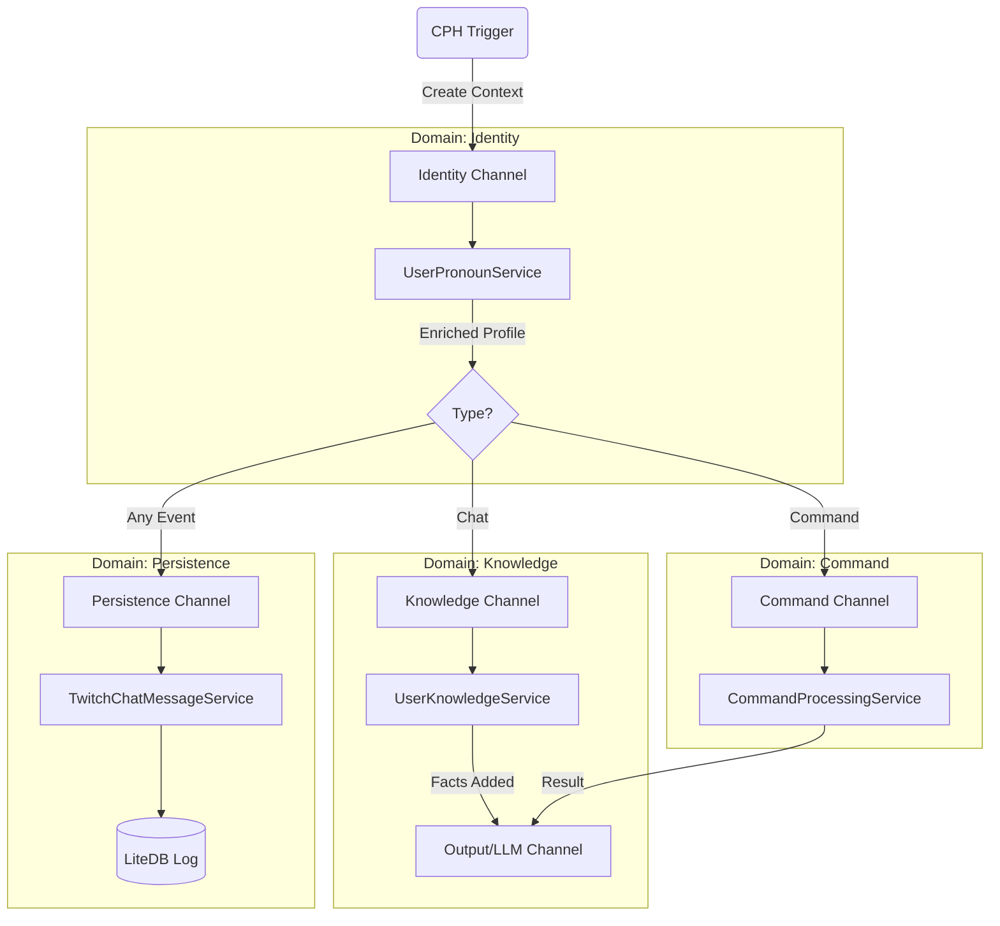

# SEDA Microservices Walkthrough (2025 Architecture)

We are building a **Staged Event-Driven Architecture (SEDA)**.
This mirrors the "Harmony" of: **Schema Domain** ↔ **Queue** ↔ **Consumer Service**.

## The Symphony
Instead of a single thread looping through steps, we have a set of independent **Workers** connected by **Queues**.

## The "Firehose" Components

### 1. Identity Stage
-   **Queue**: `IdentityChannel`
-   **Service**: `UserPronounService`
-   **Responsibility**: The high-volume "Entry" queue. fast lookups.
-   **Schema**: Matches `user_pronouns` / `user_nicknames`.

### 2. Knowledge Stage
-   **Queue**: `KnowledgeChannel`
-   **Service**: `UserKnowledgeService`
-   **Responsibility**: Complex RAG lookups (Vector/Text search). Async and potentially slower.
-   **Schema**: Matches `knowledge_base` facts.

### 3. Command Stage
-   **Queue**: `CommandChannel`
-   **Service**: `CommandProcessingService`
-   **Responsibility**: Logic execution for `!commands`.
-   **Schema**: Uses `CommandRegistry` mappings.

### 4. Persistence Stage
-   **Queue**: `ChatPersistenceChannel`
-   **Service**: `TwitchChatMessageService`
-   **Responsibility**: Write-heavy, low-latency logging. "Fire and Forget" from the main path.
-   **Schema**: Matches `chat_logs`.

## How it scales
-   If **Knowledge Lookups** get slow (e.g., API calls), the `KnowledgeChannel` buffers the backlog.
-   **Identity** continues to process new users comfortably.
-   **Persistence** happens on its own thread, never blocking the bot's response.
